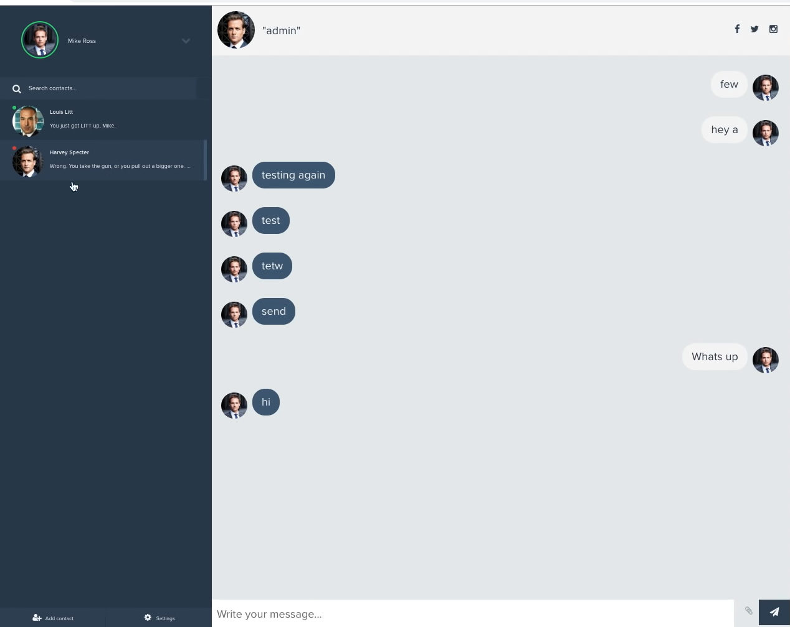

# Chat App Prototype

Using Django, SQLite, React, channels, Twisted to create a prototype of a chat app. Project solely for testing purposes, actual MVP version wasn't started.

---

### Running the app

```bash
$ py -3.8 -m venv env
$ env/Scripts/activate
$ pip install -r requirements.txt
$ python manage.py migrate
$ python manage.py runserver
```

> Note that Python 3.8 is required for proper work

Then install and launch the frontend

```bash
$ npm i
$ npm start
```

_UI demo_


